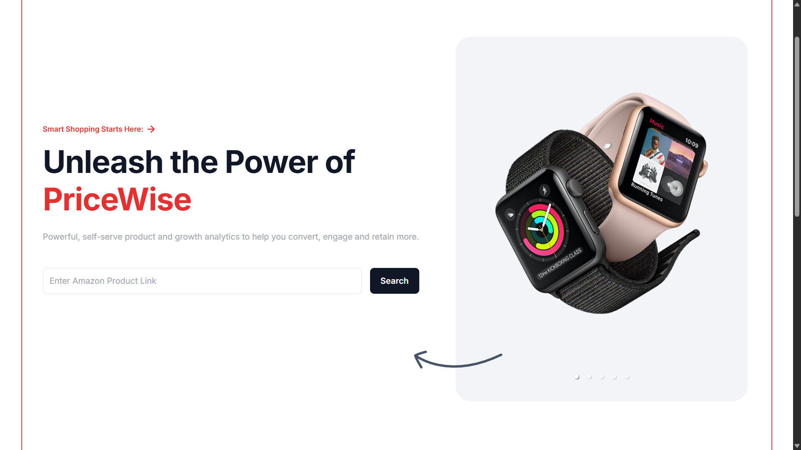
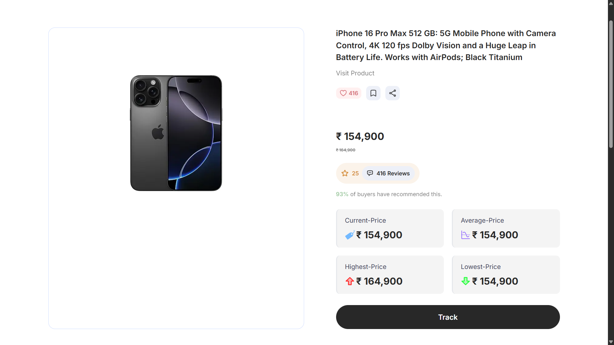

# 📦 PriceWise

PriceWise is a web application that lets you **track product prices online**.  
It uses **Puppeteer + Cheerio** for scraping e-commerce sites (like Amazon) and returns structured product data (price, title, availability, etc.) via an **Express.js API**.

---

## 📸 Preview

## ✨ Features

- 🔍 Scrape product details (title, price, image, availability)  
- 🌐 API built with Express.js  
- ⚡ TypeScript for type safety  
- 🛠 Puppeteer (headless browser) + Cheerio (HTML parsing)  
- 🔑 Environment-based configuration for flexibility  

---

## 🛠 Tech Stack

- **Backend:** Node.js, Express.js, TypeScript  
- **Scraping:** Puppeteer, Cheerio  
- **Utilities:** Body-parser, CORS  

---

## 🔧 How It Works

1. The user sends a **product URL** to the `/scrape` endpoint.  
2. Puppeteer launches a **headless browser** and navigates to the URL.  
3. The page content is retrieved and loaded into **Cheerio** for HTML parsing.  
4. Helper functions extract product details such as **title, price, availability, images, reviews, and ratings**.  
5. The data is structured and returned as a **JSON response** via the API.  

---

## 📂 Project Structure

